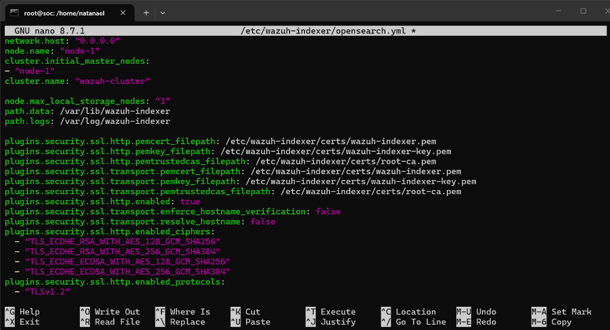

# 🛡️ SOC AI Orchestration - SOC MCP Server

[](https://www.python.org/)
[](https://modelcontextprotocol.io/)
[](LICENSE)

**SOC MCP Server** é um Centro de Operações de Segurança (SOC) avançado e totalmente automatizado projetado como um servidor **MCP (Model Context Protocol)**. Construído com Python 3.11+ e FastMCP, ele se integra nativamente com **Wazuh SIEM**, **TheHive**, **Cortex**, **MISP** e **Docker/SSH** para fornecer capacidades completas de resposta a incidentes (SOAR) e triagem de segurança via Inteligência Artificial.

---

## 🚀 Arquitetura e Recursos

Este Servidor MCP permite que qualquer assistente de IA compatível (Antigravity IDE, LM Studio, Claude Desktop, ChatGPT Codex, VS Code) atue como um **Analista de SOC L1/L2 Autônomo**.

### 🔗 Integrações Nativas
- **Wazuh SIEM**: Busca de alertas, monitoramento de agentes, verificação de portas/processos e Resposta Ativa (bloqueio de IP, isolamento de host, quarentena).
- **TheHive**: Criação automatizada de casos de incidentes, gestão de observáveis e tarefas de triagem.
- **Cortex**: Disparo de analisadores de ameaças (VirusTotal, ANY.RUN, etc.) e extração de relatórios de inteligência.
- **MISP**: Consulta de IOCs (IPs, hashes, domínios) em feeds de inteligência de ameaças e publicação de eventos.
- **Docker & SSH**: Execução segura de comandos em containers e servidores para coleta de evidências e resposta ativa.

---

## 🔄 Playbook Automatizado de Triagem SOAR (`run_soc_playbook`)

Através do playbook orquestrado, o servidor executa automaticamente:
1. **Ingestão**: Recebe e analisa o alerta de segurança do Wazuh.
2. **Extração**: Extrai automaticamente IPs, hashes MD5/SHA256, URLs e domínios (IOCs).
3. **Enriquecimento**: Consulta a base de ameaças do MISP e executa analisadores do Cortex nos IOCs extraídos.
4. **Cálculo de Risco**: Calcula o Score de Risco geral (0 a 100) com base na severidade e correlação.
5. **Abertura de Chamado**: Cria automaticamente um Caso de alta prioridade no TheHive se o risco ultrapassar o limite.
6. **Relatórios Automáticos**: Gera relatórios técnicos e executivos em Markdown dinamicamente.

---

## Catalogo de Ferramentas MCP (70 Tools)

O **SOC MCP Server** disponibiliza 70 ferramentas organizadas por modulo funcional para automacao SOAR, resposta a incidentes e inteligencia de ameacas:

### 1. Telemetria, SIEM e EDR (Wazuh)

| No | Ferramenta MCP | Modulo | Descricao Operacional |
| :---: | :--- | :---: | :--- |
| 01 | obter_alertas_wazuh | Wazuh SIEM | Consulta alertas e eventos de seguranca com filtros avancados |
| 02 | obter_resumo_alertas_wazuh | Wazuh SIEM | Agregacao estatistica de alertas por severidade e nivel |
| 03 | obter_agentes_wazuh | Wazuh EDR | Lista todos os agentes registrados na infraestrutura |
| 04 | obter_agentes_ativos_wazuh | Wazuh EDR | Filtra apenas os agentes online e ativos no cluster |
| 05 | verificar_saude_agente | Wazuh EDR | Diagnostico de conectividade, versao e status do agente |
| 06 | obter_inventario_sistema_agente | Wazuh Syscollector | Coleta hardware, sistema operacional, portas e pacotes |
| 07 | obter_processos_agente | Wazuh Syscollector | Enumeracao em tempo real dos processos ativos no host |
| 08 | obter_portas_agente | Wazuh Syscollector | Lista portas de rede abertas e servicos em escuta |
| 09 | obter_configuracao_agente | Wazuh Agent | Exibe as configuracoes ativas e modulos do agente |
| 10 | obter_vulnerabilidades_wazuh | Wazuh Vulnerability | Retorna relatorios de CVEs detectadas nos ativos |
| 11 | obter_vulnerabilidades_criticas_wazuh | Wazuh Vulnerability | Filtra apenas vulnerabilidades com severidade Critica/Alta |
| 12 | obter_detalhes_vulnerabilidade_wazuh | Wazuh Vulnerability | Metricas CVSS, descricao e orientacoes de correcao da CVE |
| 13 | obter_dados_cti_cve_wazuh | Wazuh CTI | Consulta inteligencia de ameacas associada a uma CVE |
| 14 | obter_regras_wazuh | Wazuh Rules | Consulta o catalogo completo de regras de deteccao |
| 15 | obter_detalhes_regra_wazuh | Wazuh Rules | Exibe a definicao XML, grupo e severidade de uma regra |
| 16 | buscar_eventos_fim | Wazuh FIM | Monitoramento de Integridade de Arquivos (Syscheck) |
| 17 | buscar_eventos_seguranca | Wazuh Audit | Busca em logs de auditoria e seguranca por termo |
| 18 | obter_saude_cluster_wazuh | Wazuh Cluster | Monitora a saude, carga e nos do cluster do Manager |
| 19 | obter_informacoes_gerenciador_wazuh | Wazuh Manager | Estatisticas e versao do gerenciador Wazuh |
| 20 | buscar_logs_gerenciador_wazuh | Wazuh Logs | Consulta logs operacionais internos do Manager |
| 21 | obter_logs_erro_gerenciador_wazuh | Wazuh Logs | Filtra erros criticos no gerenciador Wazuh |
| 22 | analisar_padroes_alertas | Wazuh Analytics | Identificacao de picos e anomalias de ataques no tempo |
| 23 | analisar_ameaca_seguranca | Wazuh Analytics | Analise heuristica de eventos de ameaca |
| 24 | obter_principais_ameacas_seguranca | Wazuh Analytics | Ranking das maiores ameacas detectadas na rede |
| 25 | validar_conexao_wazuh | System Check | Valida a autenticacao e conectividade da API REST |

---

### 2. Resposta Ativa e Contencao Forense (Active Response)

| No | Ferramenta MCP | Acao SOAR | Descricao Operacional |
| :---: | :--- | :---: | :--- |
| 26 | isolar_host_wazuh | Contencao | Bloqueio total de rede do ativo comprometido |
| 27 | desisolar_host_wazuh | Restauracao | Restauracao da conectividade de rede do host |
| 28 | bloquear_ip_wazuh | Firewall | Bloqueio de IP atacante no firewall do agente |
| 29 | permitir_firewall_wazuh | Firewall | Liberacao de regras de IP no firewall |
| 30 | bloquear_firewall_wazuh | Firewall | Aplicacao de regra customizada de firewall |
| 31 | encerrar_processo_wazuh | Process Kill | Encerramento imediato de processo malicioso (PID/Nome) |
| 32 | quarentena_arquivo_wazuh | Quarentena | Mover arquivos maliciosos para a quarentena isolada |
| 33 | restaurar_arquivo_wazuh | Quarentena | Restauracao de arquivo da quarentena ao disco |
| 34 | desabilitar_usuario_wazuh | Identity | Desativacao imediata de conta de usuario comprometida |
| 35 | habilitar_usuario_wazuh | Identity | Reativacao de conta de usuario |
| 36 | reiniciar_servico_wazuh | Service | Reinicializacao de servicos ou do agente Wazuh |
| 37 | resposta_ativa_wazuh | Script Exec | Disparo de scripts customizados de Active Response |
| 38 | executar_comando_resposta_ativa_wazuh | Command Exec | Execucao controlada de comandos de resposta |
| 39 | executar_avaliacao_risco | Risk Analysis | Calculo de Risk Score dinamico do ativo (0-100) |
| 40 | executar_teste_conformidade | Compliance | Auditoria contra padroes CIS / PCI-DSS / HIPAA |

---

### 3. TheHive 5, Cortex, MISP e Threat Hunting

| No | Ferramenta MCP | Integracao | Descricao Operacional |
| :---: | :--- | :---: | :--- |
| 41 | criar_caso_thehive | TheHive 5 | Abertura automatizada de casos de incidentes |
| 42 | listar_casos_thehive | TheHive 5 | Consulta da fila de casos abertos e encerrados |
| 43 | obter_caso_thehive | TheHive 5 | Detalhes de severidade, historico e status de um caso |
| 44 | atualizar_caso_thehive | TheHive 5 | Alteracao de status (Open, Resolved), tags ou TLP |
| 45 | adicionar_observavel_thehive | TheHive 5 | Registro de IOCs (Hash, IP, URL, Dominio) no caso |
| 46 | obter_observaveis_thehive | TheHive 5 | Enumeracao de todos os IOCs vinculados a um caso |
| 47 | obter_alertas_thehive | TheHive 5 | Busca/lista de alertas de segurança registrados no TheHive |
| 48 | obter_tarefas_thehive | TheHive 5 | Busca/lista de tarefas de incidentes no TheHive |
| 49 | listar_analisadores_cortex | Cortex | Exibe analisadores disponiveis (VirusTotal, Shodan) |
| 50 | executar_analise_cortex | Cortex | Submete IOCs para analise automatizada no Cortex |
| 51 | buscar_misp | MISP CTI | Pesquisa de indicadores de comprometimento no MISP |
| 52 | publicar_evento_misp | MISP CTI | Exportacao e compartilhamento de eventos no MISP |
| 53 | verificar_reputacao_ioc | CTI Global | Consulta global de reputacao de IOCs |
| 54 | investigar_alerta_wazuh | SOAR Flow | Correlacao entre Wazuh + TheHive + Cortex + MISP |
| 55 | responder_incidente_soc | SOAR Flow | Fluxo de contencao e gestao de incidente em 1-clique |
| 56 | cacada_ameacas_threat_hunting | Threat Hunting | Varredura pro-ativa de TTPs da matriz MITRE |
| 57 | investigar_ip | Forensic | Investigacao aprofundada de reputacao e trafego de IPs |
| 58 | investigar_hash | Forensic | Consulta forense de reputacao de hashes (SHA256/MD5) |
| 59 | investigar_dominio | Forensic | Analise DNS, WHOIS e reputacao de dominios |
| 60 | investigar_host | Forensic | Diagnostico completo de integridade e risco de um host |
| 61 | triagem_alerta | AI Triage | Triagem automatica com veredito (TP/FP) |
| 62 | explicar_mitre | MITRE ATT-CK | Mapeamento de taticas e tecnicas MITRE ATT-CK |
| 63 | cacada_ip | Threat Hunting | Busca de rastros de um IP em toda a telemetria |
| 64 | cacada_hash | Threat Hunting | Caca pro-ativa por hashes maliciosos nos agentes |
| 65 | gerar_relatorios_incidente | Reporting | Geracao de relatorios forenses em Markdown/PDF |
| 66 | gerar_relatorio_seguranca | Reporting | Relatorio de postura de seguranca e conformidade |

---

### 4. Gestao de Infraestrutura Docker e SSH

| No | Ferramenta MCP | Categoria | Descricao Operacional |
| :---: | :--- | :---: | :--- |
| 67 | docker_ps | Docker | Monitoramento dos conteineres ativos da pilha SOC |
| 68 | docker_logs | Docker | Coleta de logs operacionais em tempo real dos servicos |
| 69 | docker_restart | Docker | Reinicio controlado dos servicos SOC (Wazuh, TheHive, MISP) |
| 70 | ssh_execute | Administration | Execucao de comandos administrativos autorizados via SSH |

---

## Instalacao e Configuracao

### Pre-requisitos

- Python 3.11 ou superior
- Acesso as APIs do Wazuh, TheHive, Cortex e MISP
- Credenciais de acesso configuradas no arquivo .env

  ### ⚙️ Configuração Recomendada no Servidor Wazuh (Linux)

Para garantir que o servidor MCP consiga se conectar ao Wazuh a partir da sua rede local (ou máquina de desenvolvimento):

1. **Liberar as Portas no Firewall do Linux**:
   - **UFW (Ubuntu / Debian)**:
     ```bash
     sudo ufw allow 55000/tcp comment 'Wazuh Manager API'
     sudo ufw allow 9200/tcp comment 'Wazuh Indexer OpenSearch'
     sudo ufw reload
     ```
   - **Firewalld (RHEL / AlmaLinux / Rocky)**:
     ```bash
     sudo firewall-cmd --add-port=55000/tcp --permanent
     sudo firewall-cmd --add-port=9200/tcp --permanent
     sudo firewall-cmd --reload
     ```

2. **Permitir Conexões Externas no Wazuh Indexer (`/etc/wazuh-indexer/opensearch.yml`)**:
   Por padrão, o OpenSearch pode vir escutando apenas em `127.0.0.1`. Para permitir que o MCP Server consulte o Indexer na porta 9200:
   - Abra o arquivo de configuração do Indexer:
     ```bash
     sudo nano /etc/wazuh-indexer/opensearch.yml
     ```
   - Verifique ou altere a diretiva `network.host` para aceitar conexões da rede:
     ```yaml
     network.host: 0.0.0.0
     ```

   

   - Reinicie o serviço do Wazuh Indexer para aplicar as alterações:
     ```bash
     sudo systemctl restart wazuh-indexer
     ```
  ---

### 1. Clonar o repositorio

```bash
git clone https://github.com/nks1097/SOC-MCP-Server-wazuh-thehive-cortex-misp.git
cd SOC-MCP-Server-wazuh-thehive-cortex-misp
```

### 2. Criar e ativar o ambiente virtual

```bash
python -m venv .venv

# Windows
.venv\Scripts\activate

# Linux / macOS
source .venv/bin/activate
```

### 3. Instalar as dependencias

```bash
pip install -r requirements.txt
```

### 4. Configurar as variaveis de ambiente

Copie o modelo e edite com suas credenciais:

```bash
cp .env.example .env
```

Edite o arquivo .env com os dados da sua infraestrutura:

```env
# Wazuh Credentials
WAZUH_HOST=ALTERE_SUA_URL
WAZUH_USER=ALTERE_SEU_USUARIO
WAZUH_PASS=ALTERE_SUA_SENHA
WAZUH_API_PORT=55000
WAZUH_SSH_PORT=22
WAZUH_SSH_USER=ALTERE_SEU_USUARIO
WAZUH_SSH_PASS=ALTERE_SUA_SENHA

# TheHive Credentials
THEHIVE_URL=ALTERE_SUA_URL
THEHIVE_API_KEY=ALTERE_SUA_API_KEY

# Cortex Credentials
CORTEX_URL=ALTERE_SUA_URL
CORTEX_API_KEY=ALTERE_SUA_API_KEY

# MISP Credentials
MISP_URL=ALTERE_SUA_URL
MISP_API_KEY=ALTERE_SUA_API_KEY
MISP_VERIFY_SSL=false

# SSH to Docker Host (for TheHive, Cortex, MISP)
DOCKER_HOST_SSH_IP=ALTERE_SUA_URL
DOCKER_HOST_SSH_PORT=22
DOCKER_HOST_SSH_USER=ALTERE_SEU_USUARIO
DOCKER_HOST_SSH_PASS=ALTERE_SUA_SENHA

# Other Settings
LOG_LEVEL=INFO
FAST_MCP_NAME=SOC-MCP-Server
FAST_MCP_PORT=8000

# Wazuh Indexer Settings
WAZUH_INDEXER_HOST=ALTERE_SUA_URL
WAZUH_INDEXER_USER=ALTERE_SEU_USUARIO
WAZUH_INDEXER_PASS=ALTERE_SUA_SENHA
WAZUH_INDEXER_PORT=9200
```

### 5. Iniciar o servidor MCP

```bash
python start_mcp.py
```

---

## Integracao com Clientes MCP

### Antigravity IDE

Adicione ao arquivo `C:\Users\<SeuUsuario>\.gemini\config\mcp_config.json`:

```json
{
  "mcpServers": {
    "soc-mcp-server": {
      "command": "C:\\Caminho\\Para\\SOC-MCP-Server-wazuh-thehive-cortex-misp\\.venv\\Scripts\\python.exe",
      "args": [
        "C:\\Caminho\\Para\\SOC-MCP-Server-wazuh-thehive-cortex-misp\\start_mcp.py"
      ],
      "env": {
        "FASTMCP_LOG_LEVEL": "CRITICAL",
        "FASTMCP_SHOW_SERVER_BANNER": "false",
        "PYTHONIOENCODING": "utf-8"
      }
    }
  }
}
```

### LM Studio / Claude Desktop

```json
{
  "mcpServers": {
    "soc-mcp-server": {
      "command": "C:\\Caminho\\Para\\SOC-MCP-Server-wazuh-thehive-cortex-misp\\.venv\\Scripts\\python.exe",
      "args": [
        "C:\\Caminho\\Para\\SOC-MCP-Server-wazuh-thehive-cortex-misp\\start_mcp.py"
      ]
    }
  }
}
```
### ChatGPT Codex

Adicione ao arquivo `C:\Users\<SeuUsuario>\.codex\config.toml`:

```json
[mcp_servers.soc-ai]
command = "C:\\Caminho\\Para\\SOC-MCP-Server-wazuh-thehive-cortex-misp\\.venv\\Scripts\\python.exe"
args = [
  "C:\\Caminho\\Para\\SOC-MCP-Server-wazuh-thehive-cortex-misp\\start_mcp.py",
]

```

## Estrutura do Projeto

```text
SOC-MCP-Server/
|-- src/
|   |-- config/          # Configuracoes Pydantic e variaveis de ambiente
|   |-- core/            # Clientes assincronos HTTP e SSH base
|   |-- models/          # Modelos de dados Pydantic (Alertas, IOCs, Casos)
|   |-- integrations/    # Modulos de integracao (Wazuh, TheHive, Cortex, MISP, Docker)
|   |-- reports/         # Geradores de relatorios Markdown
|   |-- tools/           # Ferramentas expostas ao protocolo MCP (68 tools)
|   |-- workflows/       # Logica do Playbook SOAR de resposta a incidentes
|   +-- main.py          # Ponto de entrada do FastMCP
|-- start_mcp.py         # Script principal de inicializacao
|-- Dockerfile           # Imagem Docker
|-- docker-compose.yml   # Orquestracao Docker Compose
|-- .env.example         # Modelo de variaveis de ambiente
|-- requirements.txt     # Dependencias Python
+-- testes/              # Suite de testes unitarios e de integracao
```

---

## Licenca

Distribuido sob a licenca **Apache 2.0**. Veja o arquivo [LICENSE](LICENSE) para mais detalhes.
