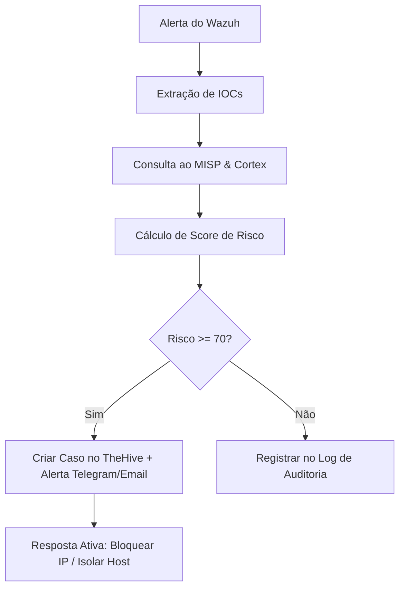

# ⚡ Recursos Avançados do Servidor SOC MCP

Este documento descreve os recursos avançados de orquestração de segurança (SOAR) integrados ao Servidor MCP.

---

## 🎯 Orquestração Multi-Plataforma (SOAR)

O servidor conecta 5 ecossistemas principais de segurança:

1. **Wazuh SIEM**: Monitoramento de eventos, triagem de alertas, verificação de integridade de arquivos (FIM), auditoria SCA e resposta ativa.
2. **TheHive**: Gestão automatizada de incidentes, criação de casos e associação de observáveis (IOCs).
3. **Cortex**: Execução de motores de análise profunda de malwares e reputação (VirusTotal, FileScan, etc.).
4. **MISP**: Feeds de inteligência de ameaças para cruzamento imediato de indicadores de comprometimento.
5. **Docker / SSH Remote**: Execução remota segura para contenção de agentes e coleta de dados brutos de evidências.

---

## 🤖 Playbook Autônomo de Analista SOC (`run_soc_playbook`)

O fluxo do playbook inteligente automatiza a rotina de um analista L1/L2:

---

## 📊 Relatórios Automáticos Executivos e Técnicos

O sistema gera relatórios dinâmicos formatados em Markdown detalhando:
- Resumo Executivo para a diretoria.
- Análise Técnica completa com evidencias, hashes e histórico no SIEM para a equipe de resposta a incidentes.
